# EXNO2DS
# AIM:
      To perform Exploratory Data Analysis on the given data set.
      
# EXPLANATION:
  The primary aim with exploratory analysis is to examine the data for distribution, outliers and anomalies to direct specific testing of your hypothesis.
  
# ALGORITHM:
STEP 1: Import the required packages to perform Data Cleansing,Removing Outliers and Exploratory Data Analysis.

STEP 2: Replace the null value using any one of the method from mode,median and mean based on the dataset available.

STEP 3: Use boxplot method to analyze the outliers of the given dataset.

STEP 4: Remove the outliers using Inter Quantile Range method.

STEP 5: Use Countplot method to analyze in a graphical method for categorical data.

STEP 6: Use displot method to represent the univariate distribution of data.

STEP 7: Use cross tabulation method to quantitatively analyze the relationship between multiple variables.

STEP 8: Use heatmap method of representation to show relationships between two variables, one plotted on each axis.

## CODING AND OUTPUT
        
```python
import pandas as pd
import numpy as np
import matplotlib.pyplot as plt
import seaborn as sns
```

```python
dt=pd.read_csv("titanic_dataset.csv")
dt
```
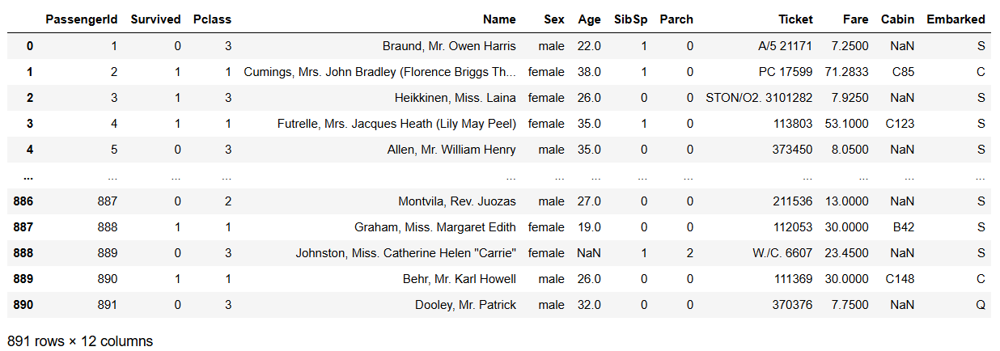  

```python
dt.describe()
```
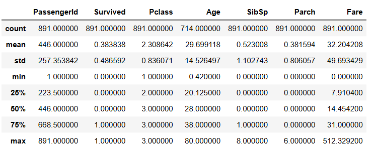  

```python
dt.info()
```
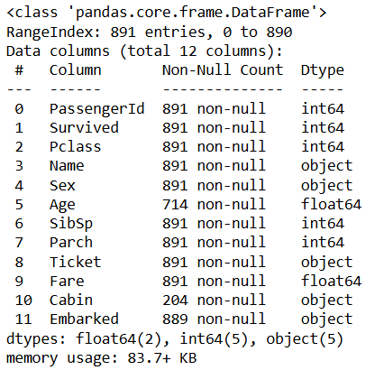  

```python
#DISPLAY NO OF ROWS AND COLUMNS
print(f"Rows: {dt.shape[0]}")
print(f"Columns: {dt.shape[1]}")
```
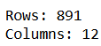  

```python
#SET PASSENGER ID AS INDEX COLUMN
dt = dt.set_index("PassengerId")
dt
```
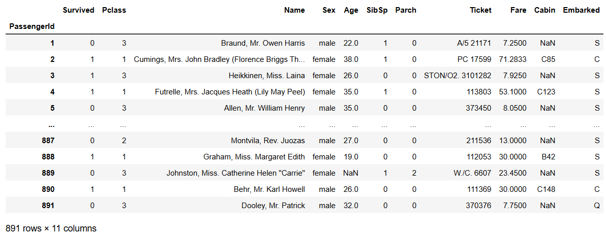  

## Caregorical Data Analysis

```python
# USE VALUE COUNT FUNCTION AND PERFROM CATEGORICAL ANALYSIS
dt["Pclass"].value_counts()
```
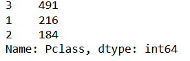  

```python
dt.dtypes
```
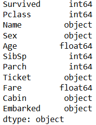  

```python
dt.nunique()
```
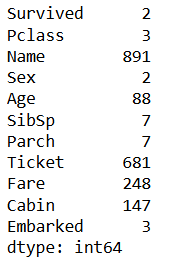  

## Uni-Variate Analysis

```python
# USE COUNTPLOT AND PERFORM UNIVARIATE ANALYSIS FOR THE "SURVIVED" COLUMN IN TITANIC DATASET
survival_count = dt["Survived"].value_counts()
print(f"Survived: {survival_count[1]}")
print(f"Died: {survival_count[0]}")
```
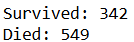

```python
sns.countplot(x="Survived", data=dt)
```
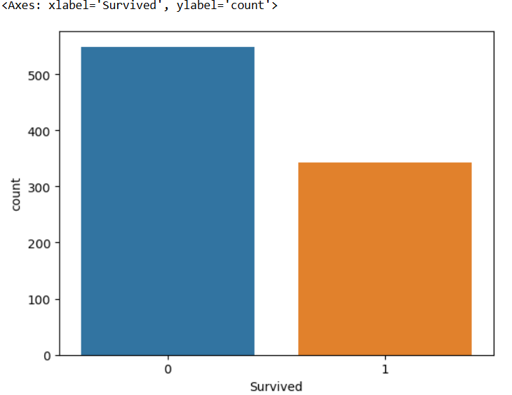  

```python
per = (dt["Survived"].value_counts()/dt.shape[0]*100).round(2)
print(f"Survival Rate: {per[0]}%")
```
  

```python
print(dt["Pclass"].unique())
```
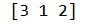  

```python
# RENAMING COLUMN
dt.rename(columns = {'Sex':'Gender'}, inplace = True)
dt
```
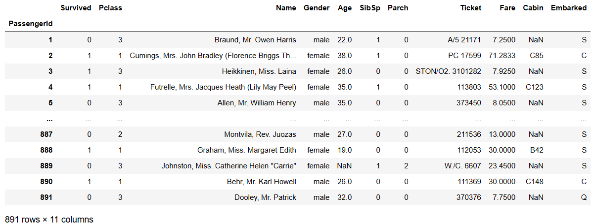  

## Bi-Variate Analysis  

```python
print(pd.crosstab(dt["Gender"], dt["Survived"]))
```
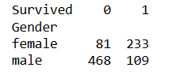  

```python
# USE CATPLOT METHOD FOR BIVARIATE ANALYSIS
sns.catplot(data=dt, x="Gender", y="Survived", kind="bar")
```
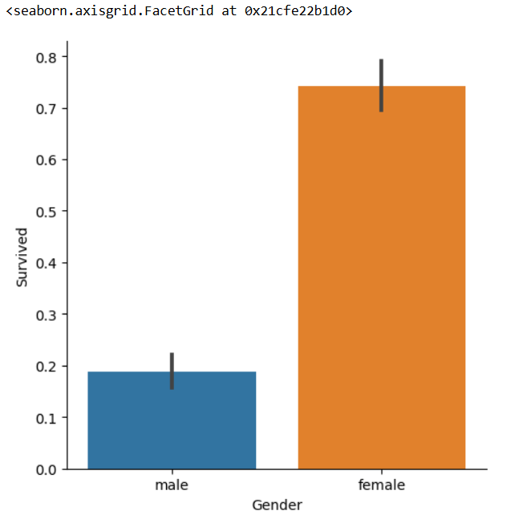  

```python
sns.catplot(data=dt, x="Gender", hue="Survived", kind="count")
plt.ylabel("Survived Count")
plt.show()
```
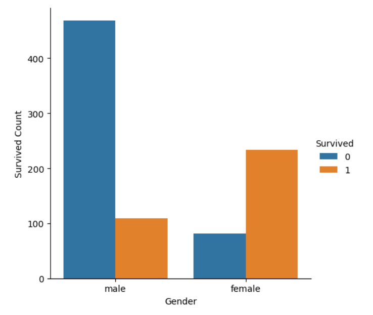  

```python
# USE BOXPLOT METHOD TO ANALYZE AGE AND SURVIVED COLUMN
dt.boxplot(column="Age", by="Survived")
```
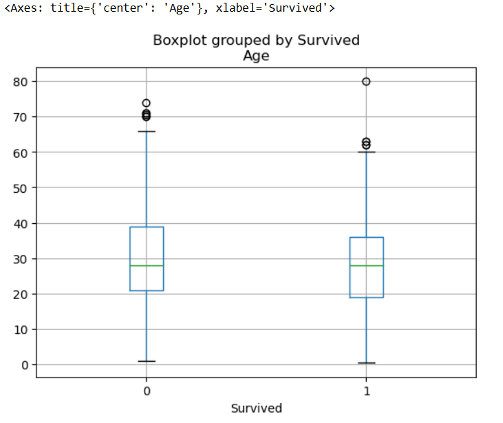  

```python
sns.scatterplot(data=dt, x="Age", y="Fare")
```
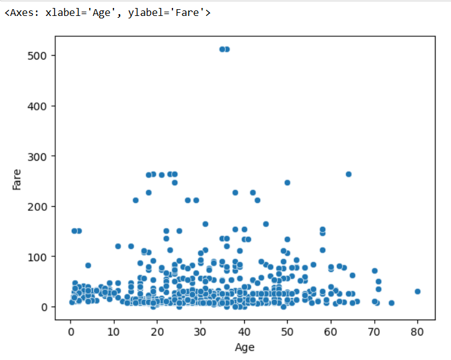  


## Multi-Variate Analysis  


```python
# USE BOXPLOT METHOD AND ANALYZE THREE COLUMNS(PCLASS,AGE,GENDER)
sns.boxplot(data=dt, x="Gender", y="Age", hue="Pclass")
```
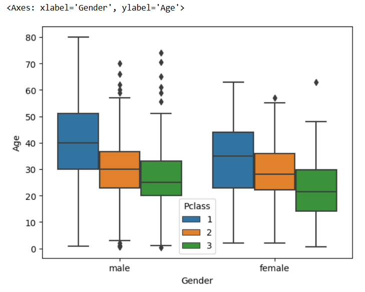  

```python
# USE CATPLOT METHOD AND ANALYZE THREE COLUMNS(PCLASS,SURVIVED,GENDER)
sns.catplot(data=dt, hue="Pclass", x="Gender", col="Survived", kind="count")
```
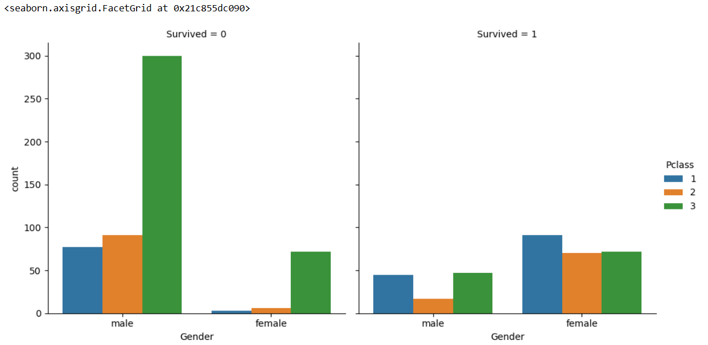  

```python
dt.columns
```
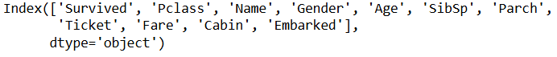  

```python
# IMPLEMENT HEATMAP AND PAIRPLOT FOR THE DATASET
columns = ['Age', 'Fare', 'SibSp', 'Parch', 'Survived']
corr = dt[columns].corr()
sns.heatmap(corr, annot=True)
```
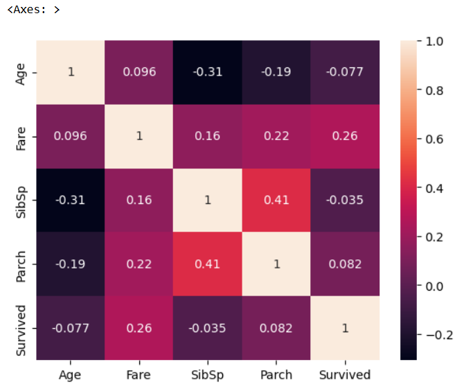  

```python
sns.pairplot(dt)
```
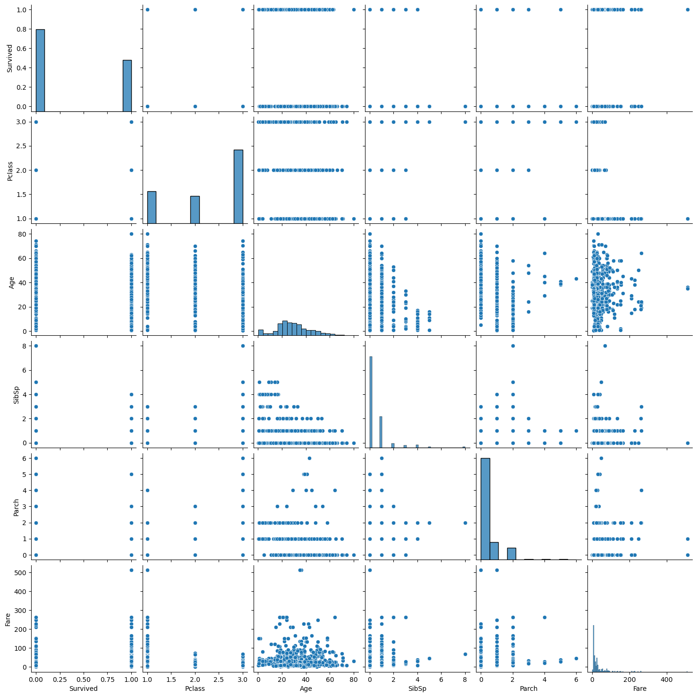  

# RESULT
        ```Thus, the Exploratory Data Analysis on the given data set was performed successfully.```


